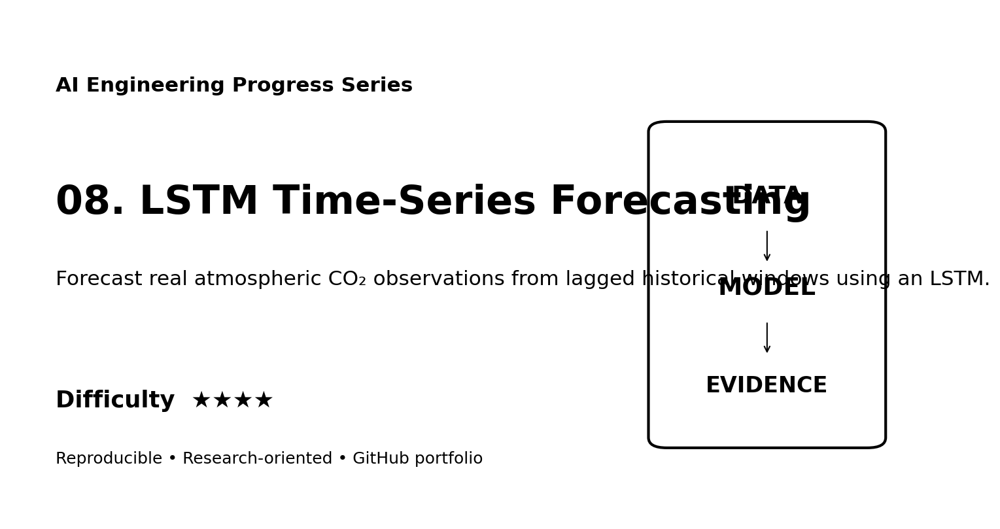
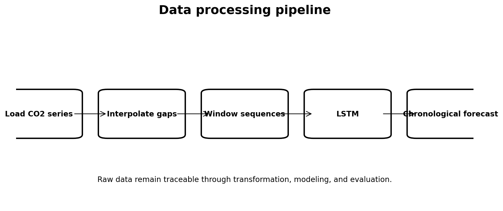
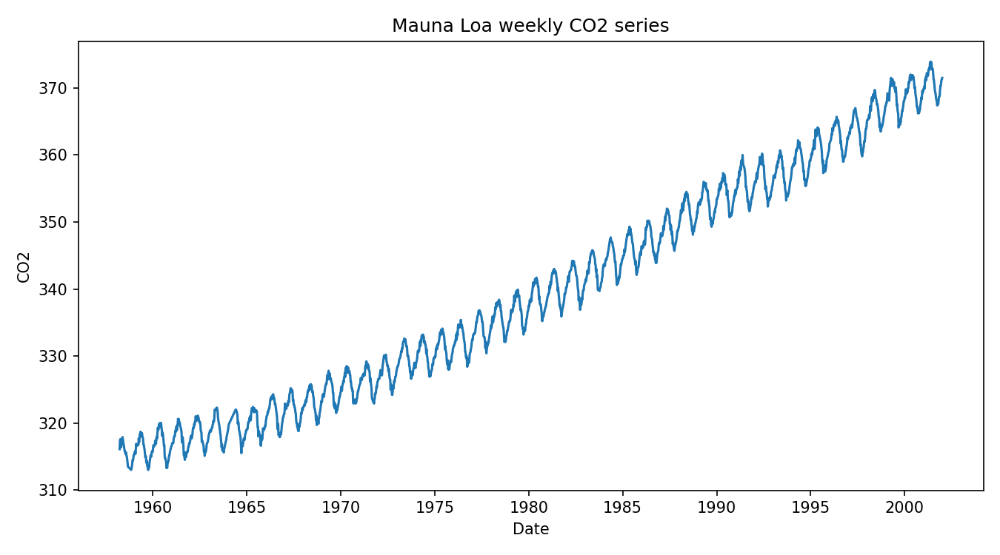
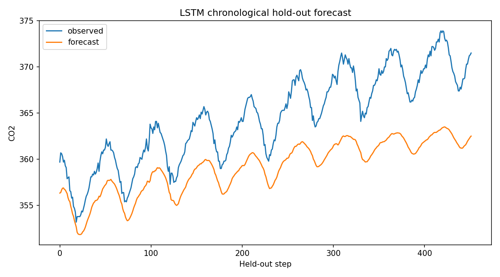

# Web Portfolio Card

## LSTM Time-Series Forecasting

**Track:** AI Engineering  
**Difficulty:** ★★★★  
**Dataset:** Mauna Loa atmospheric CO₂ dataset via statsmodels  
**Quick description:** Forecast real atmospheric CO₂ observations from lagged historical windows using an LSTM.

### Suggested website image gallery

### Suggested portfolio copy
This project demonstrates LSTM, time series, forecasting, temporal split using a reproducible workflow with explicit data provenance, processing, evaluation, limitations, and research documentation. The repository includes executable code and a scientific-style technical report suitable for supervisor review.
