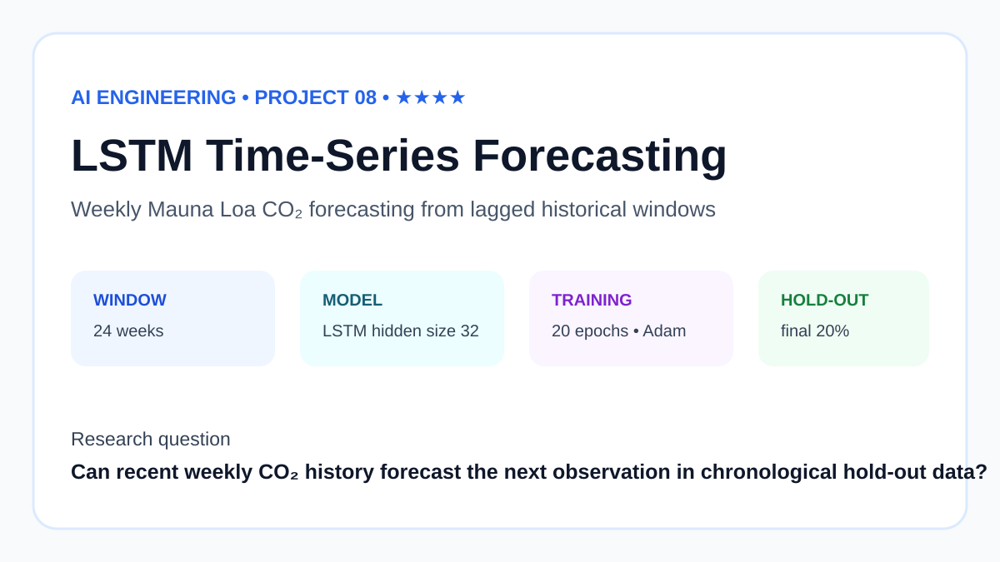
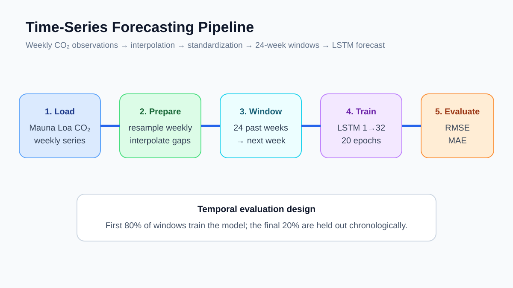
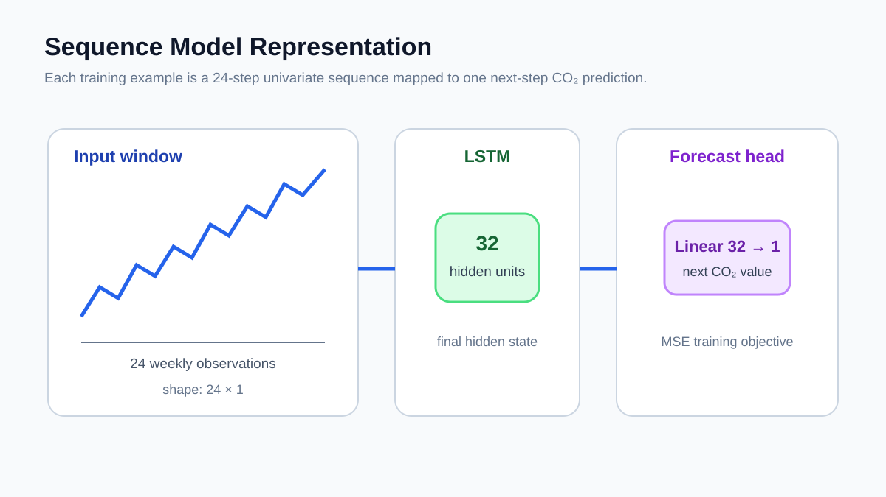
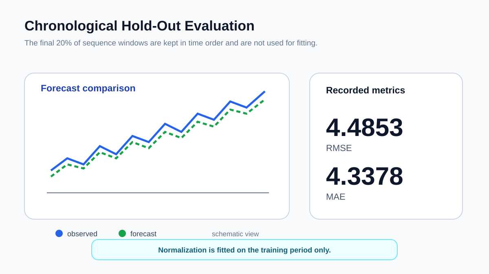

# LSTM Forecasting for Mauna Loa CO2



I built this project to move from static prediction to sequence forecasting. The task is simple to state: use the previous 24 weeks of atmospheric CO2 measurements to predict the next weekly value.

The model is a compact LSTM trained on the Mauna Loa CO2 series distributed with statsmodels.

## Data

The source series is resampled to weekly means and missing weekly values are interpolated.

For each training example I use:

- 24 previous weekly CO2 values as input;
- the next weekly value as the target.

That produces 2,260 sequence windows.

The split is chronological:

- 1,808 training windows;
- 452 held-out windows.

Normalization is fitted on the training period only, then applied to the held-out period.

## How the experiment works



The model is intentionally small:

```text
24 time steps × 1 feature
          ↓
LSTM with 32 hidden units
          ↓
final hidden state
          ↓
Linear layer: 32 → 1
          ↓
next-week CO2 forecast
```

Training uses Adam with learning rate 0.005 and mean-squared error loss for 20 epochs.

## Sequence model



The LSTM reads the 24-week window in order and carries information forward through its hidden state. The final hidden state is used to predict the next value.

## Results



After correcting preprocessing so normalization uses training data only, the recorded run produced:

| Metric | Result |
|---|---:|
| RMSE | 4.4853 |
| MAE | 4.3378 |
| Training windows | 1,808 |
| Test windows | 452 |

The hold-out set is the final 20% of the sequence windows, so the model is always evaluated on later observations than the ones used for training.

The result is useful as a compact sequence-modeling exercise, but I would not judge forecasting quality from these numbers alone. A stronger study should compare the LSTM with simple baselines such as last-value prediction, moving averages, and autoregressive models.

## Run it

```bash
python -m venv .venv
source .venv/bin/activate
pip install -r requirements.txt
python src/run_experiment.py
```

On Windows, use `.venv\Scripts\activate`.

## Repository notes

- [DATA.md](DATA.md) describes the CO2 series.
- [REPRODUCIBILITY.md](REPRODUCIBILITY.md) explains the temporal split and rerun steps.
- [paper/paper.md](paper/paper.md) contains the longer technical write-up.
