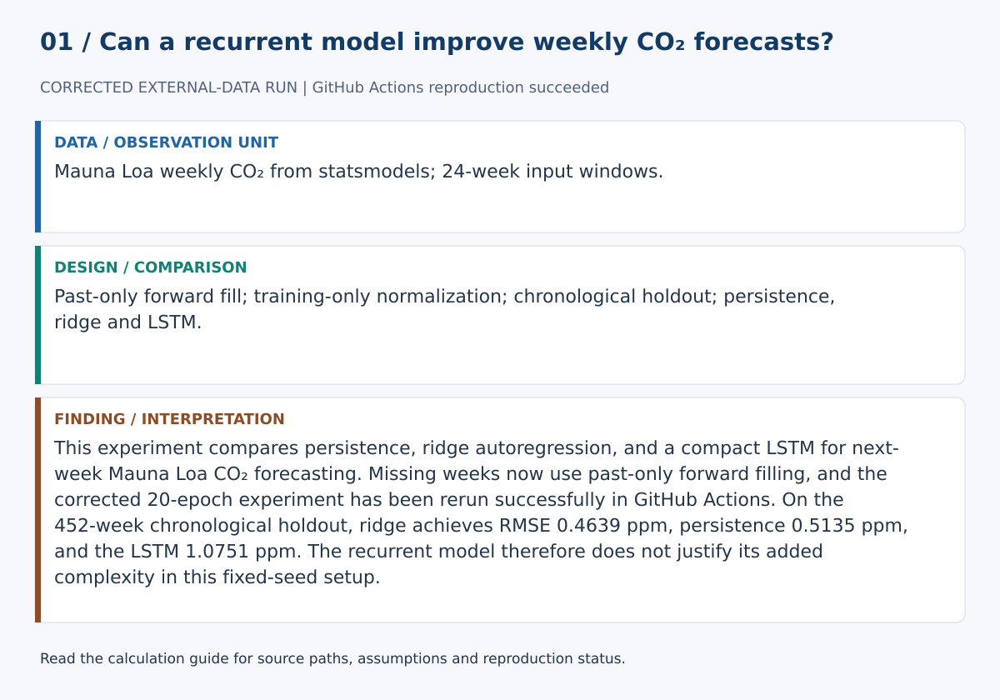
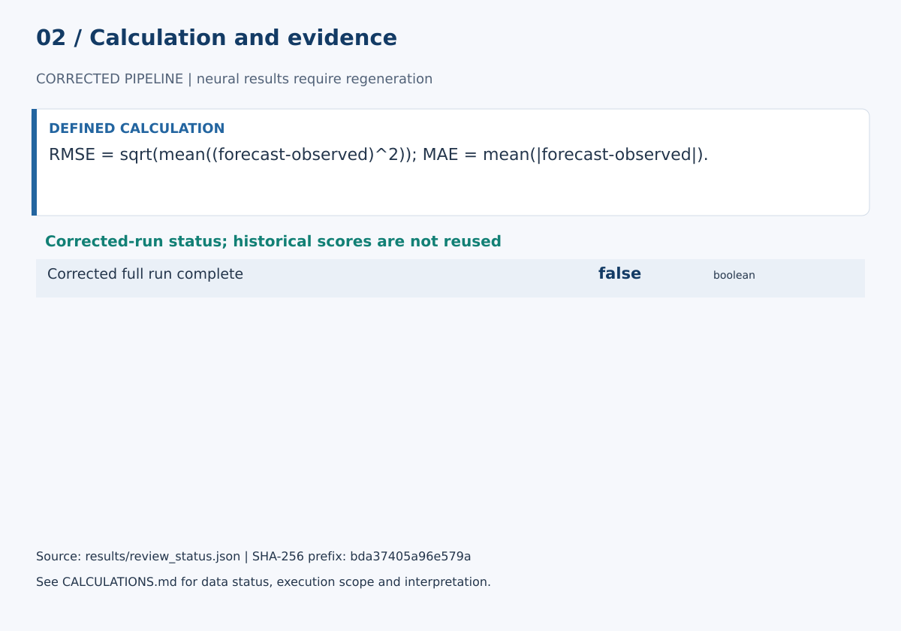

> **Results superseded for the current protocol:** past-only forward filling replaces interpolation. All original numerical comparisons below are historical and require a corrected full run.

# LSTM Forecasting for Mauna Loa CO2

## Abstract

This experiment evaluates a compact LSTM against persistence and Ridge autoregression for next-week forecasting of the Mauna Loa CO2 series. All evaluation is chronological and normalization is fitted only on the training period.

## Method

Twenty-four previous weekly observations are used to predict the next value. The first 80% of 2,260 windows are used for training and the final 20% for evaluation. The LSTM has 32 hidden units and trains for 20 epochs with Adam.

## Results

| Model | RMSE | MAE |
|---|---:|---:|
| Persistence | 0.5135 | 0.4042 |
| Ridge | 0.4641 | 0.3546 |
| LSTM | 1.0700 | 0.8540 |

## Interpretation

Ridge gives the best held-out performance, and persistence also outperforms the LSTM. The result demonstrates why sequence models should be compared against simple time-series baselines before their complexity is justified.

## Limitations

A stronger study would use rolling-origin evaluation, seasonal and autoregressive statistical baselines, repeated neural-network seeds, validation-based tuning, and uncertainty intervals.

## Calculation definitions and evidence audit

RMSE = sqrt(mean((forecast-observed)^2)); MAE = mean(|forecast-observed|).

The original results used linear interpolation before splitting. The corrected loader uses forward fill to avoid future borrowing. Historical scores are preserved for traceability but cannot substantiate the corrected protocol until a full rerun.

This repository compares persistence, ridge autoregression, and an LSTM for weekly Mauna Loa CO₂ forecasting with 24-week input windows. Review identified future-information borrowing in the original interpolation step, which has been replaced with past-only forward filling. The earlier numerical comparison is now explicitly historical; the corrected neural experiment still requires a full rerun before its performance can be presented as verified.

The [calculation guide](../CALCULATIONS.md) provides exact evidence paths and a function-level implementation map.

### Selected evidence and interpretation

| Quantity | Value | Unit / meaning | JSON path |
|---|---:|---|---|
| Corrected full run complete | False | boolean | `corrected_full_run_complete` |

These values are read from `results/review_status.json`. They must be interpreted with the split, data status and limitations above. The complete data/model experiment was not rerun in this review. The old results used interpolation and are superseded for the corrected protocol; PyTorch is unavailable here.

### Reproduction and claim boundaries

The existing suite requires unavailable dependencies; no full-suite pass is claimed. The figure generator can be checked with `python scripts/build_review_figures.py --check`. This verifies the displayed calculation evidence, not an independent replication of the complete scientific experiment. The manuscript is a working report, not a peer-reviewed publication.
